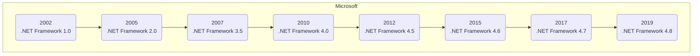
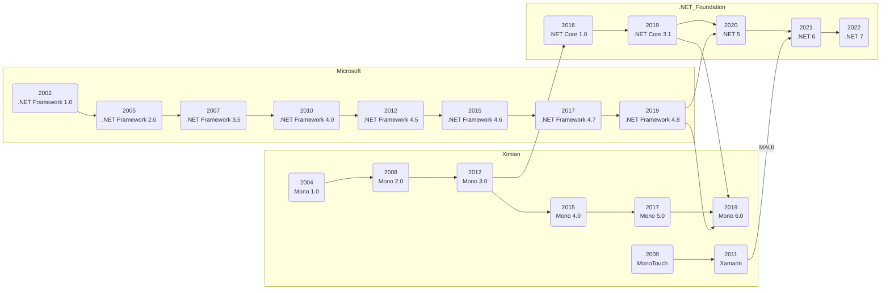

`Console.WriteLine("Hello, world!");`

---
layout: cover
class: text-center
---

# Not Your Parents' .NET

## Steve Desmond

### June 5, 2023

#### Ithaca Web People

---

## Agenda

1. What is .NET?
1. A Brief History of Time
1. Live demo some features!

---
class: 'contact'
---

## Steve Desmond

### Lead Developer @ ecoAPM

<i class="fa-solid fa-earth-america"></i> [SteveDesmond.ca](https://SteveDesmond.ca) | [ecoAPM.com](https://ecoAPM.com)

<i class="fa-brands fa-github"></i> [SteveDesmond-ca](https://github.com/SteveDesmond-ca) | [ecoAPM](https://github.com/ecoAPM)

<i class="fa-brands fa-linkedin"></i> [Steve-Desmond](https://linkedin.com/in/Steve-Desmond) | [ecoAPM](https://linkedin.com/company/ecoAPM)

<i class="fa-brands fa-mastodon"></i> [@ecoSteve @ mastodon.social](https://mastodon.social/ecoSteve)
 | [@ecoAPM @ fosstodon.org](https://fosstodon.org/@ecoAPM)

---

## What is .NET?

> free, open-source, cross-platform framework for building modern apps and powerful cloud services

- CLI
- Web
- Mobile
- Games

---

## What is .NET not?

<v-clicks>

- programming language
  - C#
  - F#
  - Visual Basic

- like JVM (Java, Kotlin, Scala, Closure, Groovy)

</v-clicks>

---

## What else is .NET not?

<v-clicks>

- proprietary [<i class="fa-solid fa-external-link"></i>](https://github.com/dotnet/runtime)
- Microsoft [<i class="fa-solid fa-external-link"></i>](https://dotnetfoundation.org)
- Windows only [<i class="fa-solid fa-external-link"></i>](https://dotnet.microsoft.com/download)
- Visual Studio [<i class="fa-solid fa-external-link"></i>](https://github.com/dotnet/sdk)
- enterprise [<i class="fa-solid fa-external-link"></i>](https://try.dot.net)
- slow [<i class="fa-solid fa-external-link"></i>](https://www.techempower.com/benchmarks/#section=data-r21&c=c&o=c)

</v-clicks>

---

## A Brief History of Time

---

## A Brief History of Time

---

## What does it look like?

> Let's create some new projects

---
layout: cover
class: 'text-center'
---

# Thanks!

---
class: 'contact'
---

# Steve Desmond

### Lead Developer @ ecoAPM

<i class="fa-solid fa-earth-america"></i> [SteveDesmond.ca](https://SteveDesmond.ca) | [ecoAPM.com](https://ecoAPM.com)

<i class="fa-brands fa-github"></i> [SteveDesmond-ca](https://github.com/SteveDesmond-ca) | [ecoAPM](https://github.com/ecoAPM)

<i class="fa-brands fa-linkedin"></i> [Steve-Desmond](https://linkedin.com/in/Steve-Desmond) | [ecoAPM](https://linkedin.com/company/ecoAPM)

<i class="fa-brands fa-mastodon"></i> [@ecoSteve @ mastodon.social](https://mastodon.social/ecoSteve)
 | [@ecoAPM @ fosstodon.org](https://fosstodon.org/@ecoAPM)
